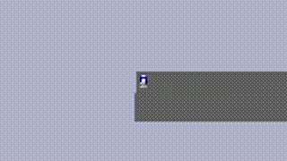
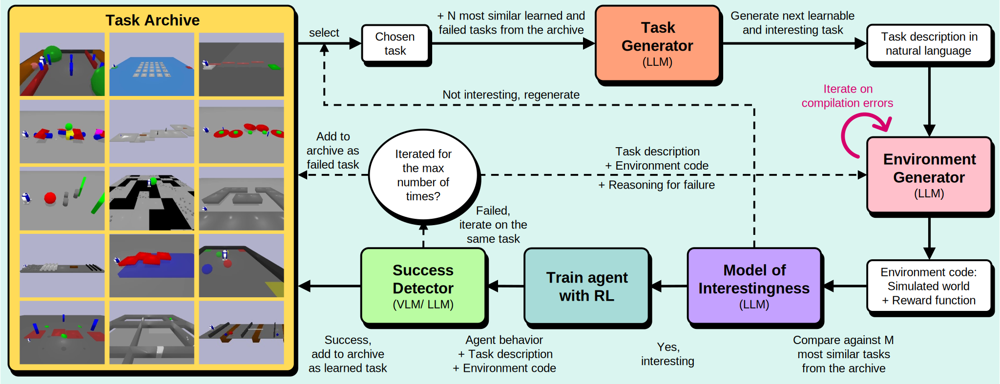

<h1 align="center">
  <b>OMNI-EPIC:<br/>Open-endedness via Models of human Notions of Interestingness with Environments Programmed in Code</b><br>
</h1>

<p align="center">
  <a href="https://https://github.com/xxxxxxx/omni-epic/blob/main/LICENSE"></a>
  <a href="https://arxiv.org/abs/2405.15568"></a>
  <a href="https://omni-epic.vercel.app/"></a>
  <a href="https://x.com/jeffclune/status/1795787632435212732"></a>
</p>

<p align="center">
  
  
  
  
</p>

Repository for **O**pen-endedness via **M**odels of human **N**otions of **I**nterestingness (**OMNI**) with **E**nvironments **P**rogrammed **i**n **C**ode (**EPIC**), that *endlessly* create learnable and interesting environments, further propelling the development of self-improving AI systems and AI-Generating Algorithms.

<p align="center">
</a><br>
</p>

## Setup - Apptainer

### Step 0: update your environment

Update your `.bashrc` with

```bash
# Add foundation model API keys to your environment
export OPENAI_API_KEY='...'
export ANTHROPIC_API_KEY='...'

# Optionally
export CUDA_VISIBLE_DEVICES=...
export WANDB_API_KEY='...'
```

### Step 1: clone the repository

Clone the repository with `git clone https://github.com/maxencefaldor/omni-epic.git`.

### Step 2: build the container

Go at the root of the cloned repository with `cd omni-epic/` and run:

```bash
apptainer build \
	--fakeroot \
	--force \
	apptainer/container.sif \
	apptainer/container.def
```

### Step 3: shell into the container

Go at the root of the cloned repository with `cd omni-epic/` and run

```bash
apptainer shell \
	--bind $(pwd):/workspace/src/ \
	--cleanenv \
	--containall \
	--env "CUDA_VISIBLE_DEVICES=$CUDA_VISIBLE_DEVICES" \
	--env "WANDB_API_KEY=$WANDB_API_KEY" \
	--env "OPENAI_API_KEY=$OPENAI_API_KEY" \
	--env "ANTHROPIC_API_KEY=$ANTHROPIC_API_KEY" \
	--home /tmp/ \
	--no-home \
	--nv \
	--pwd /workspace/src/ \
	--workdir apptainer/ \
	apptainer/container.sif
```

## Running Instructions

### Running OMNI-EPIC

```bash
python main.py
```

### Human Playable Game

```bash
python -m game.backend.app
```

For prettier frontend, on another terminal
```bash
cd game/frontend/
npm i
npm run dev
```

See more detailed readme for this in `game/frontend/README.md`

### File structure

- `analysis/` scripts used for plotting and analysis
- `apptainer/` for setting up apptainer, easier reproducability
- `configs/` configuration files used in training and analysis
- `dreamerv3/` code for DreamerV3, RL algorithm used to train the agents
- `game/` code for human playable game
- `omni_epic/` code for robots, example environments, and foundation model calls

## Citation

If you find this project useful, please consider citing:
```
@article{faldor2024omni,
	title={OMNI-EPIC: Open-endedness via Models of human Notions of Interestingness with Environments Programmed in Code},
	author={Faldor, Maxence and Zhang, Jenny and Cully, Antoine and Clune, Jeff},
	journal={arXiv preprint arXiv:2405.15568},
	year={2024}
}
```
